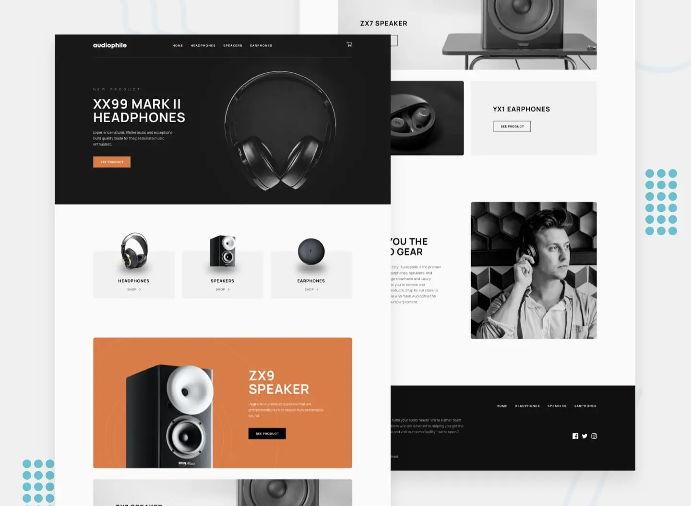

<div align="center">
  <h1>🤖 Frontend Mentor - Audiophile Ecommerce</h1>

This is a solution to the [audiophile ecommerce challenge on Frontend Mentor](https://www.frontendmentor.io/challenges/audiophile-ecommerce-website-C8cuSd_wx).

[You can view the page by clicking here](https://audiophile-ecommerce-project.pages.dev)

To generate the static pages, this project makes use of an API built in Express using a MongoDB database. [You can check the API here](https://github.com/toastycoder0/audiophile-ecommerce-api-project).



</div>

## 🚀 How to use?

First clone the repository from GitHub:

```shell
git clone https://github.com/toastycoder0/audiophile-ecommerce-project.git
```

Move to the project folder:

```shell
cd audiophile-ecommerce-project
```

Install the dependencies with the following command:

```shell
npm i
```

Start the **development** environment with the following command

```shell
npm run dev
```

## ⚙️ This application was built using the following technologies

- [Astro](https://astro.build)
- [TypeScript](https://www.npmjs.com/package/typescript)
- [Standard](https://www.npmjs.com/package/ts-standard)
- [ESLint](https://www.npmjs.com/package/eslint)
